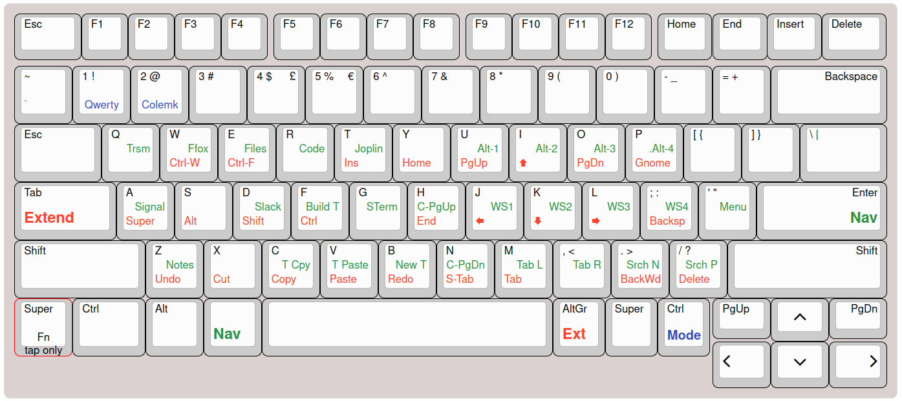

Tries to mimic the ZMK layout of my keyboards for the laptop.

Keyd repository: https://github.com/rvaiya/keyd



## The layout

While I am not bringing all the functionality of my Corne keyboards layout, the most important aspects are available.

The EXTEND layer is fairly common for Colemak layouts. Mine has seen a few changes over time. The modifiers are on the left home row, as one-shot or the usual hold while the cursor is on the right hand without having to move to the bottom right of the keyboard.

The NAV layer lets me navigate through my workspaces, terminal or browser tabs... The left hand side is mainly to jump to my most used applications.

Show the layout help: `]` + `\`. Press `q` to dismiss the popup.

### Changes to the default layer 

My keyboards of choice have six thumb keys. I use them for Shift, Space, several layers, alt characters and adaptive keys. The laptop, in comparison, has one large space bar in the middle.

The space bar is not huge (width of 5U) and I can just about reach the key on each side with my thumbs.

The EXTEND and NAV are accessible with two different keys each. This compensates a bit for the lack of well placed thumb keys. EXTEND is enabled by holding the CapsLock key or the AltGr key. NAV is on a hold of Enter or Left Alt key. A tap on Enter still works as usual. A tap on CapsLock produces a Tab since it matches my other keyboard, and Tab becomes Escape. (CapsLock is not very useful and it is available on both the EXTEND and NAV layers).

The next change is a bit unusual but works well for me. I use the space bar as both space on tap and Shift on hold. I am used to Shift on my left thumb and space on my right thumb. So I continue doing this. The difference is that they are both hitting the same large key!

Using the key on each side of space as layer keys required a couple of extra changes. Alt moves one key to the left. AltGr is still working as a one-shot for the next keypress. The Super (Windows) key moved to the completely pointless PrtSc key.

The Home Row Mods are mitigating any issue with the modifiers not all being where they might be expected.

I have managed to carefully swap the keycaps of the Alt, Fn and Windows keys so the physical layout is not too different from the programmed layout.

### Combos

I have replicated most of the combos I use on my real keyboards. The horizontal stagger makes them not as natural as on an ortholinear or vertically staggered layout. 

There are combos for several punctuation characters and copy, paste, undo, save...

### The mode selector
While the Mode key (the physical right control) is pressed, the following functions are available:
- layout change between QWERTY and Colemak.
- access to all the AltGr layers
    - level 3 (AltGr key): mostly accented characters
    - level 5 (PrtSc key): additional symbols and emojis
    - level 7 (PrtSc then AltGr keys): greek characters

The alternate characters are dependant on a custom XKB configuration that is based on the Colemak layout. When using the QWERTY layout, the positions seem a bit arbitrary.

## Config
Edit the configuration:
```
sudo vi /etc/keyd/default.conf
```

Reload configuration
```
sudo keyd reload
```

Check the log for errors:
```
sudo journalctl -eu keyd
```


