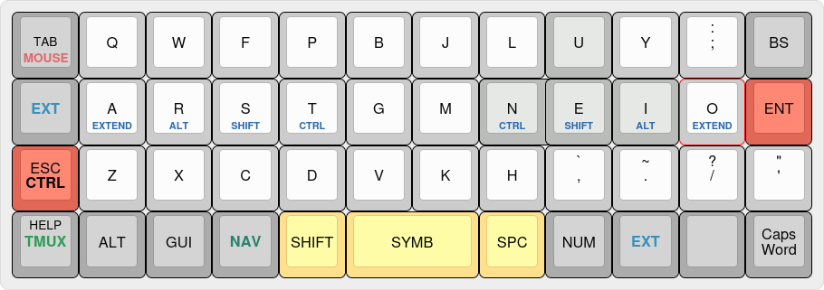
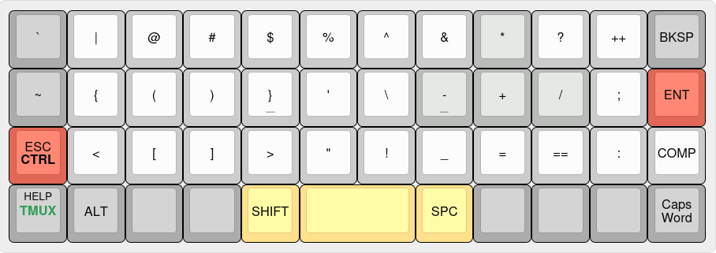
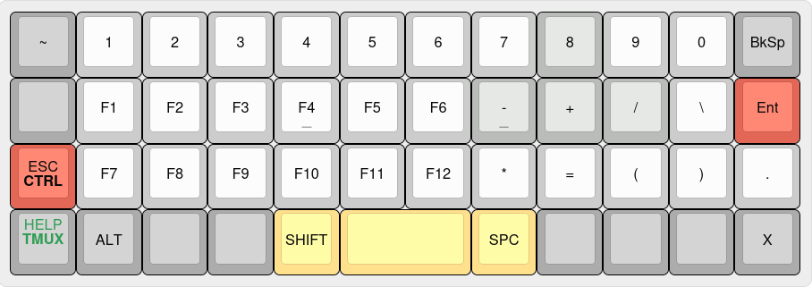
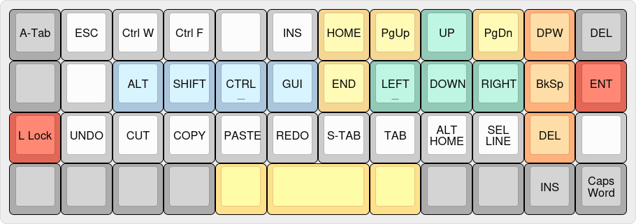
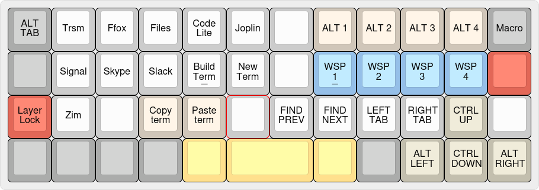
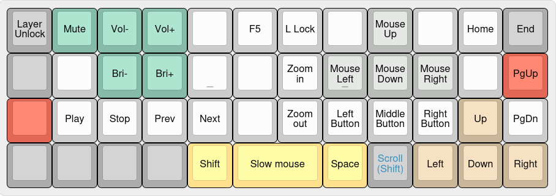
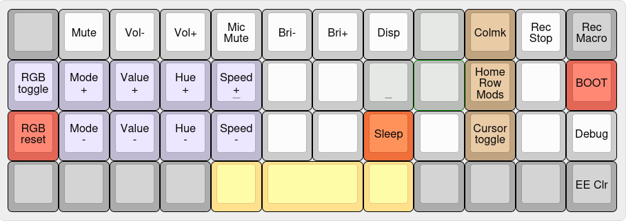

# QMK config
## Ortholinear 47 keys

This layout is very much a work in progress. It is derived from my Alice layout and adapted for the reduced number of keys.
I do not like the 2u spacebar in the middle as I can't deal with having my thumbs in asymetrical positions. So I use the keys
on either sides for SHIFT and SPACE. The spacebar becomes the `Symbols` key.

To get help, pressing `Shift-Help` shows the layout for the current layer on screen until the key is released. In the main layer `Alt-Shift-Help` displays the layout for the AltGr symbols.

#### Main layer

Tap the symbols `SYMB` key once for a One-Shot of the `AltGr` symbols with a custom [XKB](../xkb/README.md) configuration.
Holding the key accesses the Symbols layer described below. The normal Linux Compose key is available on the symbols layer.

Tapping the Tmux key sends `Ctrl-A` and holding it sends `Ctrl-A` before each key press until released.

A [leader key](LeaderKey.md) sequence is started with a double tap on the `Tmux` key.

#### Symbols layer

A long press on `(`, `[` or `{` open and close the parenthesis or bracket and move the cursor in the middle. A long press 
on `!`, `&` or `=` outputs the symbol twice and surrounded by spaces.

#### Numbers layer

#### Extend layer
Accessible with the `EXT` keys. Press Layer lock key `LLOCK` to lock to this layer and again to exit it.

#### Nav layer
Accessible with the `NAV` key. 

`Space` alternates between the two previous windows.

Find next and previous work in several editors (F3 and Shift-F3). With Shift, switches to "Find in files" mode (F8 and Control-F8).   
Tab switching is with Control-Alt-PgUp/Dn and works is several editors and can be configured in gnome-terminal and others.  
Dynamic macros 1 and 2 are recorded in the System layer.  
Application shortcuts work with the [run-or-raise](../run-or-raise/README.md) Gnome extension.  

#### Media and browsing layer

This layer is dedicated to browsing and other non-typing activities. It is accessed by holding the `TAB` key or activated by the
combo `TAB` + `Q`.

#### System layer
Accessible by activating both the Extend and Nav layers at the same time.

The default layer changes are persistent between reboots. The cursor layer at the bottom right is not persistent.

RGB defaults returns to the rainbow effect and 100% brightness.

### Layout images
The layouts were created with [keyboard-layout-editor.com](http://www.keyboard-layout-editor.com).

[blank](http://www.keyboard-layout-editor.com/#/gists/3bfed02864e018f692c1bb9a38c1b25) -
[main](http://www.keyboard-layout-editor.com/#/gists/b42f83b159878ef53c8cfe383613fbdb) -
[extend](http://www.keyboard-layout-editor.com/#/gists/5c048b99cea0962223a2aa11d8d6f741) -
[nav](http://www.keyboard-layout-editor.com/#/gists/b65235844553a408eae33be10ab5b621) -
[system](http://www.keyboard-layout-editor.com/#/gists/7d0409ff0df964887f6e4fe35cc3be79)
