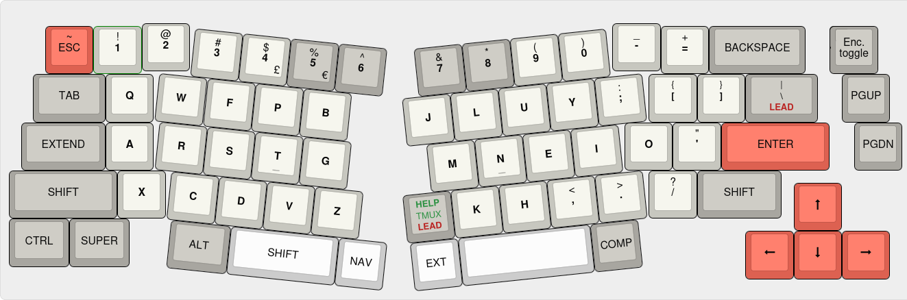
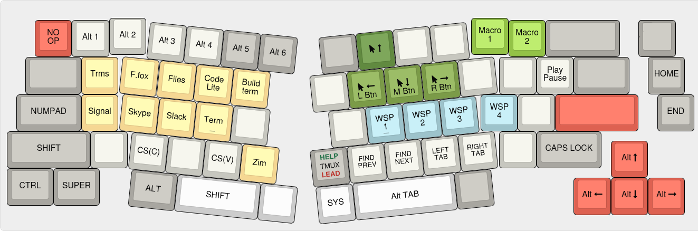

# QMK config
## Alice 69 keys (Keychron)

To get help, pressing `LShift-Help` shows a the layout for the current layer on screen until the key is released. In the main layer `Alt-Shift-Help` displays the layout for the AltGr symbols.

#### Main layer

Encoder moves the cursor word by word in most contexts and Control reverts to moving character by character. Press the encoder to toggle to the alternate mode where it acts as the mouse scrollwheel.

The backtick is on `AltGr-Esc` (also on the Extend layer over the apostrophe). 

Tap the `Compose` (COMP) key once for the normal Linux compose behaviour or hold it for `AltGr` symbols.

The alternate characters are configured in [XKB](../xkb/README.md).

Tapping the Tmux key sends `Ctrl-A` and holding it sends `Ctrl-A` before each key press until released.

There are two ways to start a [leader key](LeaderKey.md) sequence. A double tap on the Tmux key or a tap on the backslash. The backslash is still available on the same key with a double tap or with `AltGr`. This is still a bit experimental.

#### Extend layer
Accessible with the EXTEND or EXT keys. Press LAYER LOCK to lock to this layer and again to exit it.

Encoder controls the volume.

The arrow keys move the mouse cursor, or act as the scrollwheel with `Shift`. The mouse buttons are activated with `Alt`. 

#### Nav layer
Accessible with the NAV key. 

Encoder controls the screen brightness and external monitor brightness with Shift.

`Space` alternates between the two previous windows.

Find next and previous work in several editors (F3 and Shift-F3). With Shift, switches to "Find in files" mode (F8 and Control-F8).   
Tab switching is with Control-Alt-PgUp/Dn and works is several editors and can be configured in gnome-terminal and others.  
Dynamic macros 1 and 2 are recorded in the System layer.  
Application shortcuts work with the [run-or-raise](../run-or-raise/README.md) Gnome extension.  

The mouse keys are duplicated on this layer, mostly to quickly move the cursor out of the way.

#### System layer
Accessible by activating both the Extend and Nav layers at the same time.

Encoder control the brightness of the RGB effects or with `Shift` the brightness of the indicators. The encoder button toggles the RGB effects while keeping the indicators.

RGB defaults returns to the rainbow effect and 100% brightness.

### Layout images
The layouts were created with [keyboard-layout-editor.com](http://www.keyboard-layout-editor.com).

[blank](http://www.keyboard-layout-editor.com/#/gists/3bfed02864e018f692c1bb9a38c1b25) -
[main](http://www.keyboard-layout-editor.com/#/gists/b42f83b159878ef53c8cfe383613fbdb) -
[extend](http://www.keyboard-layout-editor.com/#/gists/5c048b99cea0962223a2aa11d8d6f741) -
[nav](http://www.keyboard-layout-editor.com/#/gists/b65235844553a408eae33be10ab5b621) -
[system](http://www.keyboard-layout-editor.com/#/gists/7d0409ff0df964887f6e4fe35cc3be79)
