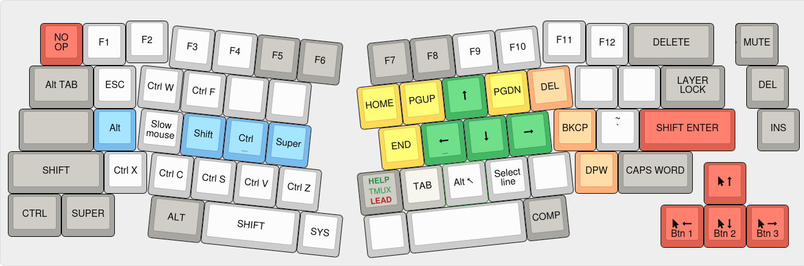

# QMK config
## Alice 69 keys (Keychron)

#### Main layer

Encoder moves the cursor word by word in most contexts and Control reverts to moving character by character.

The backtick is on `AltGr-Esc` (also on the Extend layer over the apostrophe). 

The alternate characters are configured in [XKB](../xkb/README.md).

#### Extend layer
Accessible with the EXTEND or EXT keys. Press LAYER LOCK to lock to this layer and again to exit it.

Encoder controls the volume.

The arrow keys move the mouse cursor, or act as the scrollwheel with `Shift`. The mouse buttons are activated with `Alt`. 

#### Nav layer
Accessive with the NAV key. 

Encoder controls the screen brightness and external monitor brightness with Shift.

Find next and previous work in several editors (F3 and Shift-F3). With Shift, switches to "Find in files" mode (F8 and Control-F8).   
Tab switching is with Control-Alt-PgUp/Dn and works is several editors and can be configured in gnome-terminal and others.  
Dynamic macros 1 and 2 are recorded in the System layer.  
Application shortcuts work with the [run-or-raise](../run-or-raise/README.md) Gnome extension.  

#### System layer
Accessible by activating both the Extend and Nav layers at the same time.

Encoder control the brightness of the RGB effects or with `Shift` the brightness of the indicators. The encoder button toggles the RGB effects while keeping the indicators.

RGB defaults returns to the rainbow effect and 100% brightness.

