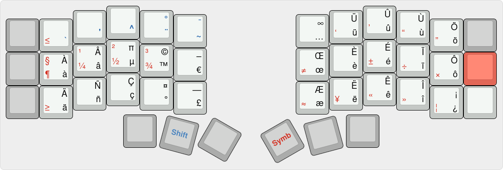

# XKB user configuration

#### Alternate symbols layout



#### Installation

### Wayland

Copy the xkb directory to `.config`.

Set the modified keyboard option:
```
dconf write /org/gnome/desktop/input-sources/xkb-options "['lv3:ralt_switch', 'compose:rwin', 'yann_custom:intl']"
```

To reload after a change:
```
dconf write /org/gnome/desktop/input-sources/xkb-options "['lv3:ralt_switch', 'compose:rwin']"
dconf write /org/gnome/desktop/input-sources/xkb-options "['lv3:ralt_switch', 'compose:rwin', 'yann_custom:intl']"
```

Get the current value:
```
dconf read /org/gnome/desktop/input-sources/xkb-options
```

Use `/usr/share/X11/xkb/symbols/us` as a source for the key names.
`/usr/include/X11/keysymdef.h` for the full list.

### X11

Doesn't work very well!

